# Self Driving Car - Simple and Advanced Lane Detection.

This project was part of Udacity Nanodegree. I have not taken the course but trying to complete all the project assignments in the course. Lane detection (Simple and Advanced) are part of assignment in Term 1

Video links to the output of the pipeline and brief explanation of each steps used in the pipeline follows the video links.
 

## Advanced Lane Detection

These are the goals of this project taken from the Udacity assignment page. 
 
- Compute the camera calibration matrix and distortion coefficients given a set of chessboard images.  
- Apply a distortion correction to raw images.
- Use color transforms, gradients, etc., to create a thresholded binary image.
- Apply a perspective transform to rectify binary image ("birds-eye view").
- Detect lane pixels and fit to find the lane boundary.
- Determine the curvature of the lane and vehicle position with respect to center.
- Warp the detected lane boundaries back onto the original image.
- Output visual display of the lane boundaries and numerical estimation of lane curvature and vehicle position.  

#### Compute the camera calibration matrix and distortion coefficients given a set of chessboard images.
Initial step is to compute the camera calibration matrix to undistort the images. This is done by using a set of chess board pattern images in which chess board pattern is on a plane surface. Atleast 10 chessboard pattern images are required for camera calibration matrix computation.  

There are various kinds of distortion that could occur in the images taken and the ones we consider correcting in this problem are  radial and tangential distortion. Radial distortion results in straight lines appearing curved/bulged out. The bulging increases with the distance from the center. Tangential distortion occurs due to misalignment of lens wrt projection plane(or imaging plane). This results in some areas seeming nearer than other. 

Camera intrinsic and extrinsic parameters are also required to perform camera calibration. Intrinsic (Matrix **K**) parameters are as the name suggests, intrinsic to the camera. That is the focal length, camera principle point and skew. Extrinsic (Matrix **P**) parameters include the rotation and translation matrices. The matrices below shows both intrinsic and extrinsic parameters used for camera calibration. 

In the description below **xkI** are points on the image plane. And similarly **XkW** are points in world coordinate. OpenCV has an API for camera calibration returns distortion coefficients, intrinsic and extrinsic matrices. After learning these parameters, they can be used to undistort the images. 

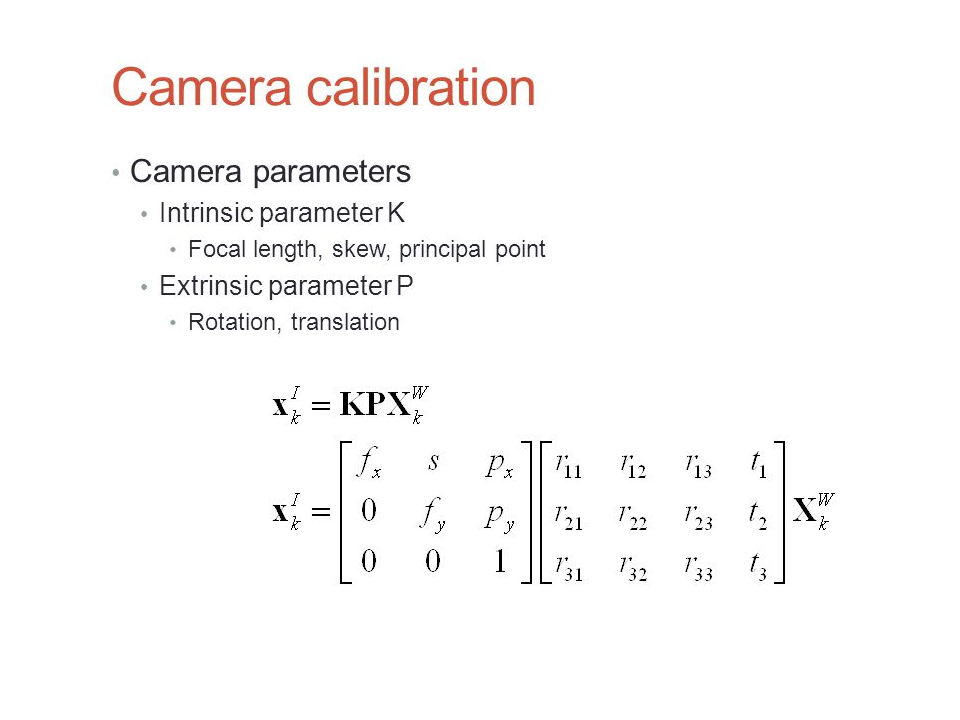

Image below shows one of the chess board patterns used for camera calibration. The cyan points are overlayes after corners are detected.

<figure>
<figcaption>Chess board pattern along with corner point overlayed</figcaption>
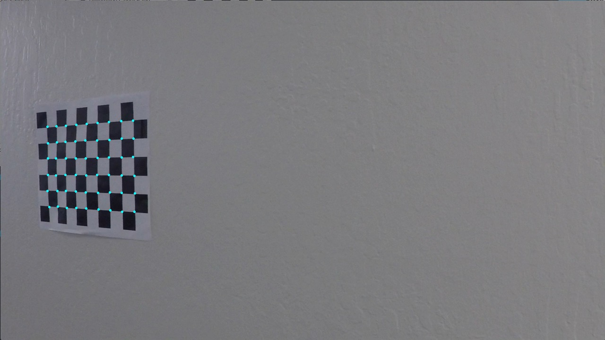
</figure>

#### Apply a distortion correction to raw images.

The parameters learnt from previous step is used to undistort every frame in the lane detection. Images before and after undistortion respectively are shown below.

<figure>
<figcaption>Before undistortion</figcaption>
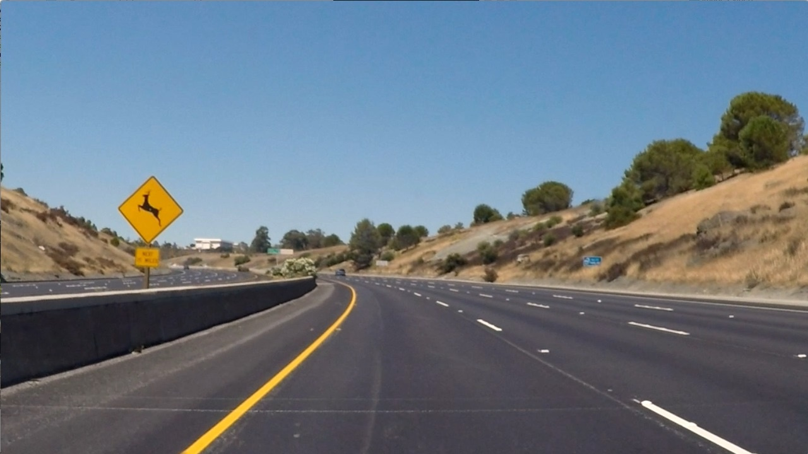<figcaption>After undistortion</figcaption>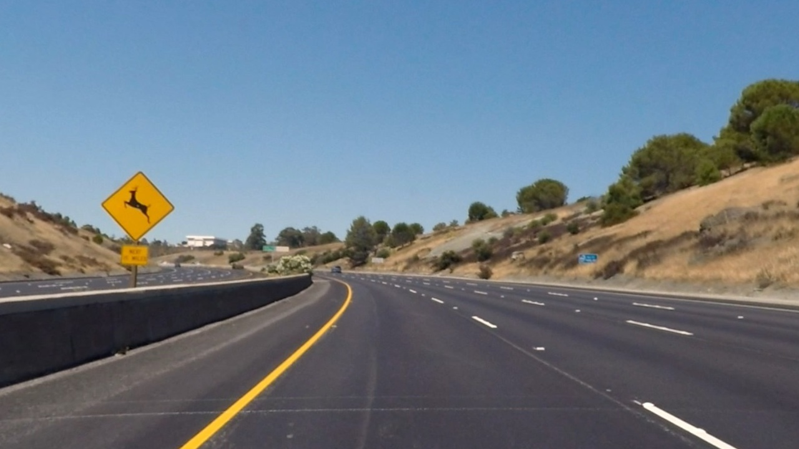</figure>

#### Use color transforms, gradients, etc., to create a thresholded binary image. 

Typical image in lane detection has the road and on it are lane markers (white and yellow in this case). Lane markers can be curved and also be dashed line instead of continuous. 

Straighforward way to extract lanes is to use yellow and white color thresholds. Since color threshold are to be applied, HSV seems to be the right color model because it factors an image into image color (H) and brightness(V) and saturation (S) denotes how saturated the cole(H) is. 

Along with threshold on color transform, gradients can also be used to elimate the noise further. Gradients are basically the amount of change the pixel values undergo in some direction. Both  thresholded color and gradient tranforms are used to get an image that has most of the noise eliminated on the roads. Color transformed with yellow and white filtered, Gradient magnitude and direction outputs are shown below.

<figure>
<figcaption>Color tranform and passing both Yellow and White colors</figcaption>
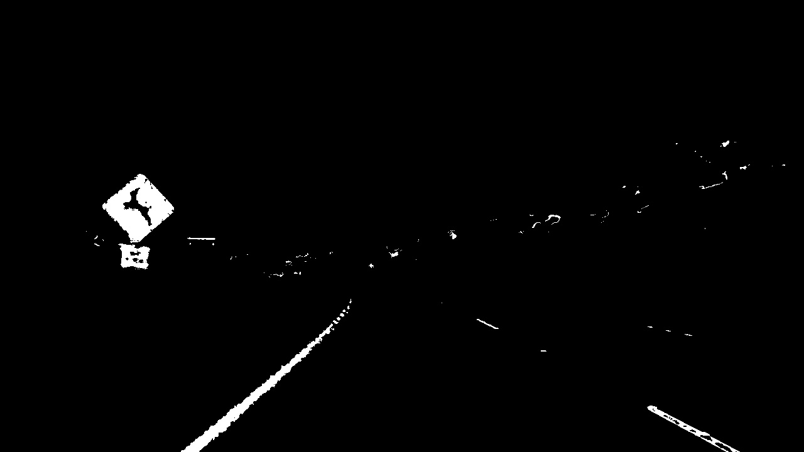

<figcaption>Magnitude and direction of the gradient transform.</figcaption>
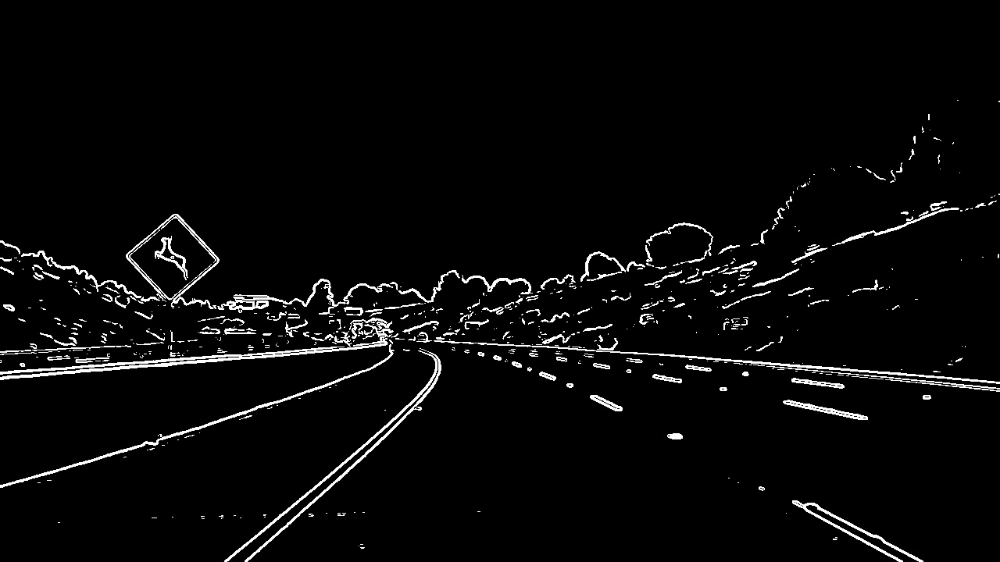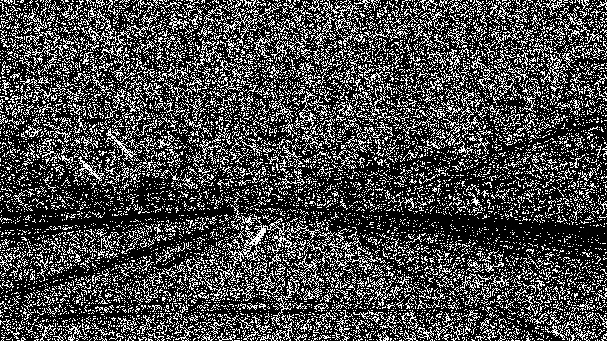

</figure>

#### Apply a perspective transform to rectify binary image ("birds-eye view").

Current view from camera on the vehicle makes it difficult to extract the lane information. Hence it would be easier if we had the lane view as though a bird flying over the road would see. Therefore, we apply perspective transform to get such an image. To do that, I take the bottom half triangle and tranform it into a different view point. That is transform the perspective from source points 
 [  588.   446.]
 [  691.   446.]
 [ 1126.   673.]
 [  153.   673.] to [  200.     0.]
 [ 1080.     0.]
 [ 1080.   720.]
 [  200.   720.]. Transformation matrix is computed using source and destination points. Below image illustrates the perspective transformation. 
 
<figure>
<figcaption>Perspective transformation showing the birds-eye view of the road. </figcaption>
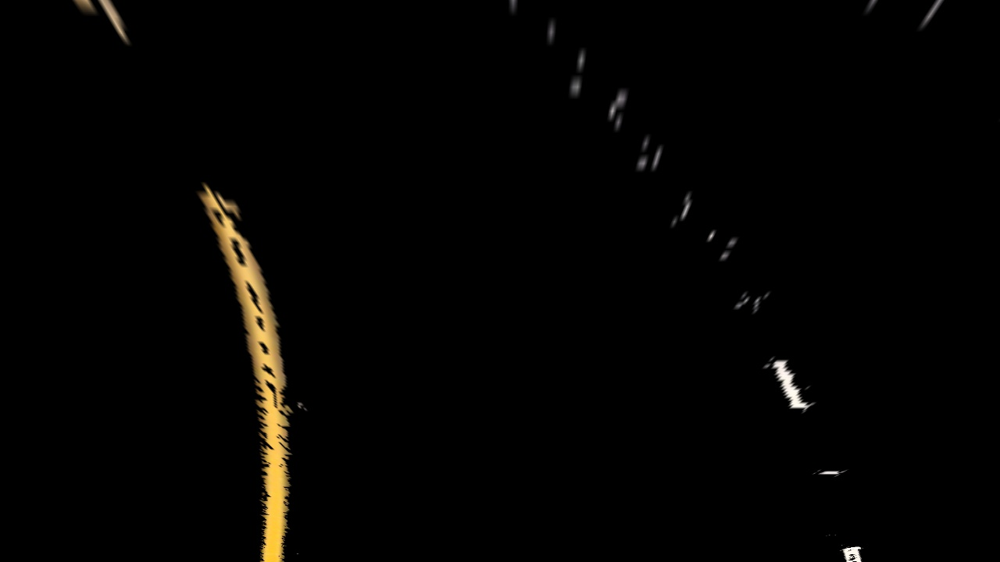

</figure>
 
#### Detect lane pixels and fit to find the lane boundary.

From the perspective transformed image, goal is to detect the lanes. To do that, I split the transformed image into two halves(left and right) and partition each parts vertically into 9 parts called sub-parts. And apply pixel value histogram to each partition. This pixel value information can be used to track the lanes in each sub-part. It is easier to descibe this using an image which is shown below. First image illustrates the histogram color pixel values of the left half and the following images illustrates the right half
  
<figure>
<figcaption>Histogram of pixel values of left half of perspective transformed image</figcaption>
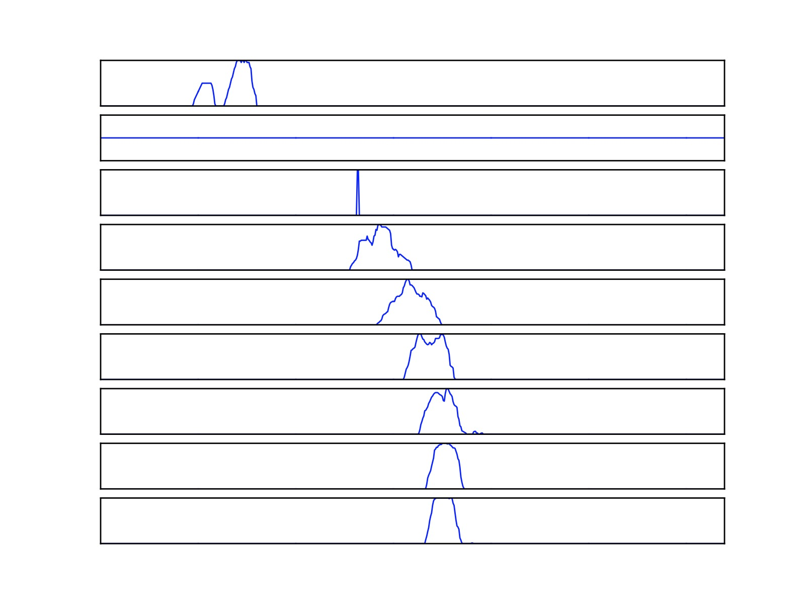

<figcaption>Histogram of pixel values of right half of perspective transformed image.</figcaption>
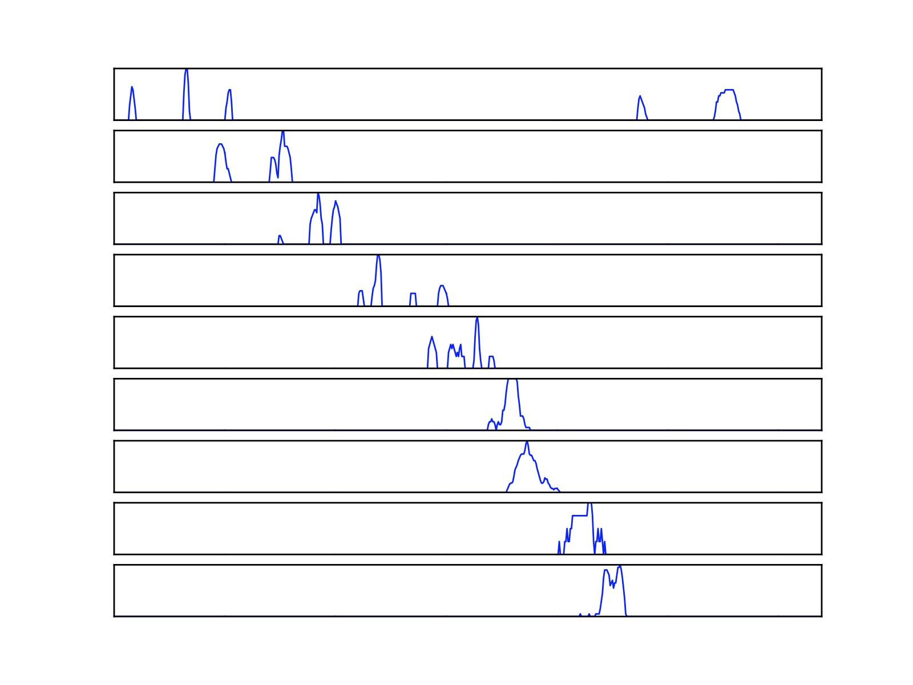

</figure>

Next, The location of the maximum is computed for each sub-part and these maximum points can be used to fit a line after that. Combining both left and right histogram images along with maximum point overlayed for each sub-part. 

<figure>
<figcaption>Histogram of pixel values of perspective transformed image and maximum point overlayed.</figcaption>
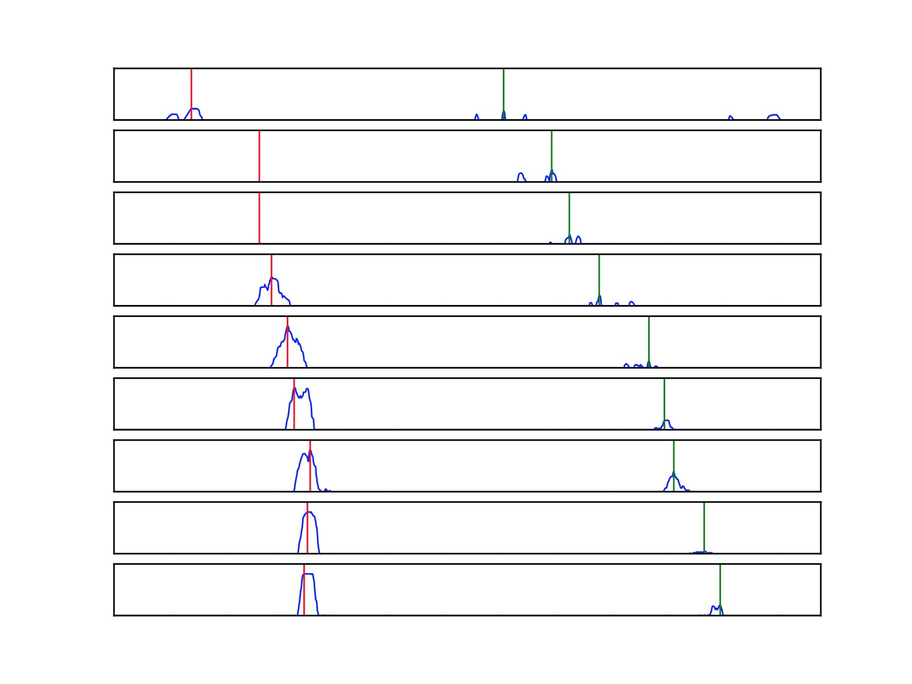

</figure>

The locations of the maximum value for each sub-part is used to fit a line since the maximum value indices does contain noise and for cases of  dashed lane lines, the maximum does not exist. The points and the fit lines are overlayed on the  transformed image to demostrate the operation below. 

<figure>
<figcaption>Maximum value points overlay.</figcaption>

<figcaption>Maximum value points and fitted line overlay.</figcaption>
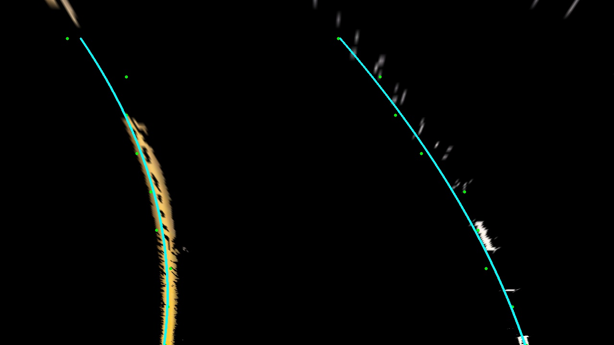

</figure>

#### Determine the curvature of the lane and vehicle position with respect to center.

To compute the vehicle postion and curvature, the ratio of number of pixels and actual road length covered with the pixels considered is exploited. The points are used to fit a second degree polynomial and the polynomial coeficients are used to compute the curvature. 

#### Warp the detected lane boundaries back onto the original image.

Since we need to detect lanes on the original view and not the "bird-view" image, it is required to transform the fitted line back to the original view. To do this, inverse of the matrix used to transform from original view to birds-eye view can be used. This is visualised in the picture below along with the green overlay to mark the lane.

<figure>
<figcaption>Line transformed back to original view.</figcaption>
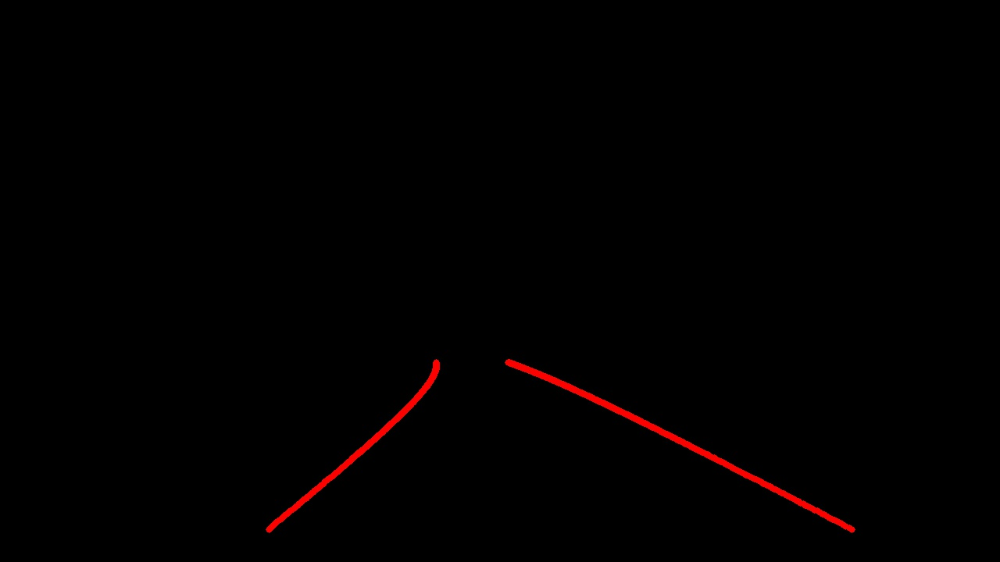

<figcaption>Transformed line along with green color overlay to mark the lane.</figcaption>
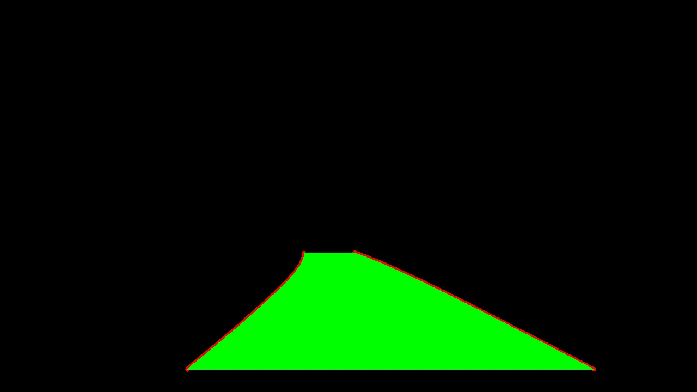

</figure>

#### Output visual display of the lane boundaries and numerical estimation of lane curvature and vehicle position.

To wrap up the pipeline, the overlay green is overlayed on the original image to mark the lanes. The curvature and vehicle position wrt lanes are also displayed on the image. 

<figure>
<figcaption>Final image</figcaption>
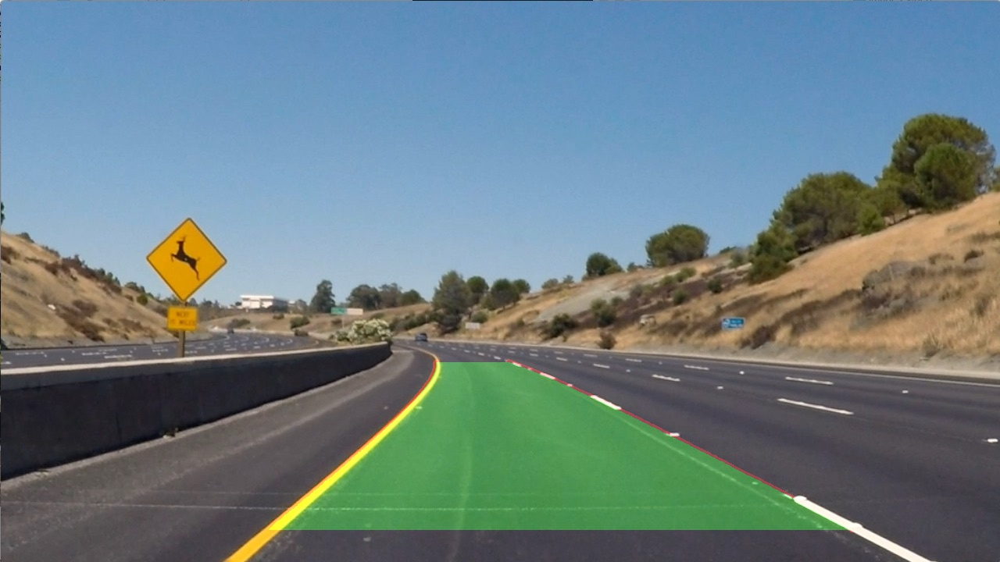
</figure>

Same process is applied on each frame in the test video and the output is written into a new video. These videos can be viewed below along with the output of intermediate steps appended. Click on the image below, it will open an youtube video.

Simple lane detection post is coming up. 

<!--

##### Simple Lane Detection

- Hello 1
- Hello 2-->

