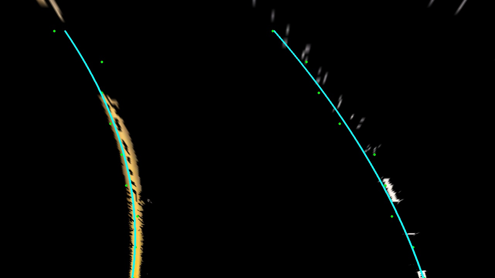

#### Self Driving Car - Simple and Advanced Lane Detection.

This project was part of Udacity Nanodegree. I have not taken the course but trying to complete all the project assignments in the course. Lane detection (Simple and Advanced) are part of assignment in Term 1

##### Advanced Lane Detection
These are the goals of this project taken from the Udacity assignment page. 
- Compute the camera calibration matrix and distortion coefficients given a set of chessboard images.
- Apply a distortion correction to raw images.
- Use color transforms, gradients, etc., to create a thresholded binary image.
- Apply a perspective transform to rectify binary image ("birds-eye view").
- Detect lane pixels and fit to find the lane boundary.
- Determine the curvature of the lane and vehicle position with respect to center.
- Warp the detected lane boundaries back onto the original image.
- Output visual display of the lane boundaries and numerical estimation of lane curvature and vehicle position.

###### Compute the camera calibration matrix and distortion coefficients given a set of chessboard images.

<!--  -->

##### Simple Lane Detection

- Hello 1
- Hello 2

